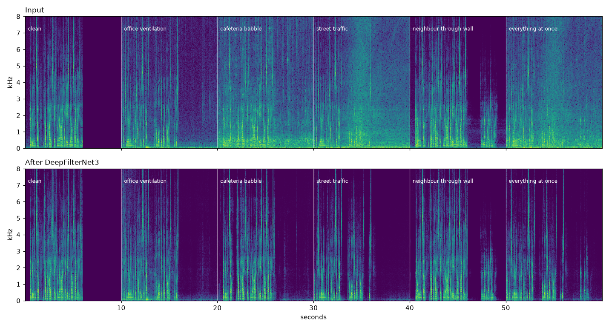

# NoiseGate

[](#licence)
[](#install)
[](https://www.rust-lang.org/)
[](#the-model)
[](#privacy)

### Your voice goes to the call. The rest of the room doesn't.

Everything removes fans and keyboard clatter. NoiseGate removes **the people talking around you** — the child in the next room, a partner on the phone, the desk behind you — and leaves your own voice untouched.

It runs in the tray, uses about 4% of one core, and needs nothing from the internet.

> **Status: pre-alpha.** Windows 10/11, MSVC toolchain. It works and it is in daily use, but it has not been through many hands yet.

---

## The problem nobody else solves

Fans, hum and typing are *stationary* noise. Every denoiser handles those; Windows does some of it for free.

Your neighbour's voice is a different problem — because every speech-enhancement model is trained to **preserve speech**, and your neighbour is speech.

Here is the same 60-second recording — one person at the microphone, a child talking loudly across the room — through four backends. Background speech is the middle of the level distribution; your own voice is the top:

| backend | background speech | your voice |
|---|---|---|
| **DeepFilterNet3** | **−19.3 dB** | −0.1 dB |
| GTCRN | −11.1 dB | −0.9 dB |
| RNNoise | −6.5 dB | −0.4 dB |
| MossFormer2 (newer, larger) | −5.5 dB | −0.2 dB |

The newest and largest model came **last**. It is excellent at enhancing speech, so it faithfully preserves the voice you wanted gone.

DeepFilterNet3 is the outlier: it discriminates on proximity and reverberation, which is exactly the cue that separates *you* from *the room*. So that is what NoiseGate ships, tuned for surrounding conversation rather than hiss.

### Hear it, and rebuild it

That recording has my family in it, so it stays on my disk. This one doesn't — it is assembled from openly licensed audio by a script in this repo, and you can build the identical file:

```bash
uv run scripts/make_demo_sample.py     # LibriSpeech + DEMAND, ~1.3 GB once
noisegate --denoise samples/demo_raw.wav samples/demo_cleaned.wav
uv run scripts/analyse_demo.py         # the table below, and the picture
```

🔊 **[before](samples/demo_raw.mp3)** · **[after](samples/demo_cleaned.mp3)** · **[RNNoise, for comparison](samples/demo_rnnoise.mp3)**

One voice throughout, six ten-second segments, a different problem in each:



| segment | DeepFilterNet3 | RNNoise |
|---|---|---|
| office ventilation | +2.6 dB | **+7.4 dB** |
| cafeteria babble | **+8.0 dB** | +4.5 dB |
| street traffic | **+10.2 dB** | +7.5 dB |
| **neighbour through wall** | **+3.6 dB** | **−0.0 dB** |
| everything at once | **+9.6 dB** | +6.8 dB |

Signal-to-noise improvement measured **while the person is speaking** — the only moment that is hard, because you cannot solve it by muting.

Read the last row first: against a competing voice **RNNoise achieves nothing at all**, and it is not a broken build — it is a 2017 model trained on noise, doing exactly what it was designed to do. Read the first row second: for plain ventilation hum RNNoise is *nearly three times better* than the model we ship, at 1/50th the CPU. Both facts are in the box.

<details>
<summary><b>Why not just measure the quiet bits between sentences?</b></summary>

Because it flatters whichever model gates hardest. That was the first version of this measurement, and by it RNNoise beat DeepFilterNet3 on every single row — including the neighbour, where it does nothing. Scoring the pauses rewards silence, and silence is free.

The neighbour is only a problem while *you* are talking, so that is when it is measured. This mixture is synthetic precisely so that is possible: `demo_clean_reference.wav` is the near voice alone, which makes the error signal exactly the part that should not be there.

The same trap, in its more expensive form, is in [`docs/training.md`](docs/training.md) — it is how two overnight training runs were scored as successes before anyone listened to them.
</details>

Caveat on the sample: LibriSpeech is 16 kHz, so nothing above 8 kHz is real. DEMAND has no airshow, so "traffic" and "cafeteria" stand in for the outdoor and crowd cases; inventing a synthetic aeroplane would have proved nothing.

---

## Install

**[Download the installer](https://github.com/Yashsomalkar/noisegate/releases)** and run it. Per-user, no administrator prompt, no driver.

The model ships inside it. Nothing is downloaded on first run, and there is no "now go and fetch a 16 MB file from Hugging Face" step.

You also need a **virtual audio cable** — the thing that lets other apps hear the cleaned microphone. NoiseGate explains this on first run and offers to open the download page. [VB-Cable](https://vb-audio.com/Cable/) is free and takes about two minutes.

Then, in Zoom, Teams, Discord, OBS or your browser: **pick `CABLE Output` as your microphone.** That's it.

<details>
<summary><b>Build from source instead</b></summary>

```powershell
git clone https://github.com/Yashsomalkar/noisegate
cd noisegate
cargo build --release
```

The default build includes everything: RNNoise, DeepFilterNet3 via tract, and the ONNX loader. The model is in `models/`, so a fresh clone gives you a working binary.

Requires the MSVC toolchain (`rustup default stable-x86_64-pc-windows-msvc`).
</details>

---

## Using it

Left-click the tray icon to toggle denoising. The icon shows the state at a glance:

| | |
|---|---|
| **teal** | on, cleaning your microphone |
| **orange** | bypassed, passing audio straight through |
| **⚠ badge** | audio is not flowing — the device went away, and it is trying to recover |

Right-click for the menu: pick a microphone, switch backend, toggle start-with-Windows, open the log folder.

**Microphones are remembered in preference order.** Click one and it becomes first choice; the rest shift down. Unplug it mid-call and the next one down takes over on its own, rather than the app stopping to ask. Plug it back in and it is picked up again.

A cable's own output is greyed out in the picker, because selecting it would have NoiseGate record from the very cable it writes into.

---

## Try it without touching your audio setup

You do not have to install a cable, or route anything, to hear what it does:

```powershell
# Record 10 seconds from your microphone
.\noisegate.exe --record 10 test.wav

# Clean it up
.\noisegate.exe --denoise test.wav clean.wav
```

It prints what it did:

```
noise_floor="-67.1 -> -100.2 dB (-33.2)"  speech="-25.4 -> -26.0 dB (-0.7)"  rtf="0.038"
```

33 dB off the background, 0.7 dB off your voice, at 26× realtime. That is the whole product in one line.

---

## Privacy

**There is no network code in this program.** No telemetry, no update check, no model download, no crash reporting. The binary does not link a HTTP client.

Your microphone audio goes to the DSP thread and into the virtual cable. Nowhere else. This started as a security audit of an audio app, and that property is deliberate — the model is bundled precisely so that first run does not need to fetch anything.

The only things NoiseGate writes are `%APPDATA%\NoiseGate\config.toml` and a log file that rotates at 5 MB. The log records device names, so it is worth a glance before pasting into a bug report.

---

## The model

DeepFilterNet3, by [Hendrik Schröter](https://github.com/Rikorose/DeepFilterNet) — dual MIT/Apache-2.0, which is why we can ship it. Attribution travels with it in [`models/NOTICE.md`](models/NOTICE.md).

We do not ship someone's prebuilt file. The model is **exported from the published checkpoint by a script in this repo**, so every artefact in the chain can be rebuilt:

```bash
uv run scripts/export_dfn3.py
```

That fetches the checkpoint, converts it, and writes the model the app loads. No clone, no Rust toolchain, no manual pip — [uv](https://docs.astral.sh/uv/) handles the environment. [`docs/model-pipeline.md`](docs/model-pipeline.md) covers how it works and the several traps involved.

Two backends, switchable from the tray while running:

| backend | background speech | CPU | needs |
|---|---|---|---|
| **DeepFilterNet3** (default) | −19 dB | ~4% of one core | nothing — bundled |
| **RNNoise** | −6.5 dB | ~0.3% of one core | nothing — embedded |

RNNoise earns its place: ~50× less compute, no model file at all, and genuinely good at fans and hiss. It simply cannot touch a voice in the next room, because it was trained not to. NoiseGate falls back to it automatically if no model is found, so it always does something useful.

---

## Configuration

`%APPDATA%\NoiseGate\config.toml` — created on first run, edited live by the tray menu.

```toml
microphones = ["Microphone (Yeti)", "Microphone (Webcam)"]  # preference order
output_device = ""        # empty = find the virtual cable automatically
enabled = true            # master on/off
use_onnx = true           # false = RNNoise
attenuation_db = 100.0    # how hard to suppress; 100 = no limit, 25 = gentler
model_path = ""           # empty = use the model beside the executable
```

Devices are named, not numbered. Endpoint IDs are opaque GUIDs that change every time you replug a device — names survive.

**`attenuation_db` is the one worth knowing about.** At 100 the model may suppress as much as it likes, which occasionally means a passage of exact digital silence between sentences. If that reads as a dropped call to the person listening, try 25: a little background stays, and the output never goes fully dead.

---

## How it works

```
physical mic ─► WASAPI capture ─► ring A ─► DSP thread ─► ring B ─► WASAPI render ─► CABLE Input
                                                                                          │
                                                     other apps select "CABLE Output" ◄────┘
```

Three dedicated MMCSS "Pro Audio" threads, lock-free SPSC ring buffers with 80 ms of headroom, 480-sample (10 ms) frames end to end — the native frame size for both models, so nothing is reblocked inside the DSP path.

A watchdog watches both halves. WASAPI reports a dead stream by simply never signalling again — no error, no callback — so the honest signal is whether frames are still moving. If either the capture or the output side stops, the icon badges and the pipeline is rebuilt quietly, without a dialog interrupting your call.

---

## Contributing

Every pull request runs format, lint, build, test and a coverage ratchet on Windows.

```powershell
cargo fmt --all -- --check
cargo clippy --all-targets --all-features
cargo test --all-features
```

[`docs/testing.md`](docs/testing.md) explains the ratchet — a floor that may be raised but never lowered — and is honest about which parts cannot be covered without hardware, and about two fixes that have no test at all and why.

Tests are written **test-first**: write it, watch it fail for the right reason, then fix. A regression test that has never been seen to fail is not a regression test.

---

## Not included

- macOS / Linux (the `audio-io` crate is Windows-only; the rest is portable)
- Far-end denoising — only your microphone is cleaned, not what you hear
- Acoustic echo cancellation
- Auto-update

---

## Credits

- **[DeepFilterNet](https://github.com/Rikorose/DeepFilterNet)** — Hendrik Schröter et al. The model, and the tract runner that streams it correctly.
- **[RNNoise](https://gitlab.xiph.org/xiph/rnnoise)** — Jean-Marc Valin / Xiph.Org, via **[`nnnoiseless`](https://github.com/jneem/nnnoiseless)** by jneem.
- **[VB-Cable](https://vb-audio.com/Cable/)** — VB-Audio. The free virtual driver every Windows routing app depends on.
- **[`windows`](https://github.com/microsoft/windows-rs)**, **[`tray-icon`](https://github.com/tauri-apps/tray-icon)**, **[`winit`](https://github.com/rust-windowing/winit)**, **[`ringbuf`](https://github.com/agerasev/ringbuf)**, **[`ort`](https://github.com/pykeio/ort)**.
- Inspired by **[NoiseTorch](https://github.com/noisetorch/NoiseTorch)**, the Linux equivalent.

## Licence

Code: **MIT or Apache-2.0**, your choice.

The bundled DeepFilterNet3 weights are MIT/Apache-2.0 — redistributable, commercial use included. RNNoise is BSD. There is nothing here you cannot ship.

The demo audio in `samples/demo_*.mp3` is **not** MIT. It is built from [LibriSpeech](https://www.openslr.org/12/) (CC BY 4.0) and [DEMAND](https://zenodo.org/records/1227121), and is redistributed here under **CC BY-SA 3.0** — full attribution in [`samples/demo_ATTRIBUTION.txt`](samples/demo_ATTRIBUTION.txt). DEMAND's licence is stated inconsistently by its own sources (Zenodo says CC BY 4.0, the paper says CC BY-SA 3.0), so the share-alike reading is the one applied.

## Issues & discussion

- [Report a bug or request a feature](https://github.com/Yashsomalkar/noisegate/issues)
- [Discussions](https://github.com/Yashsomalkar/noisegate/discussions) for questions and ideas
